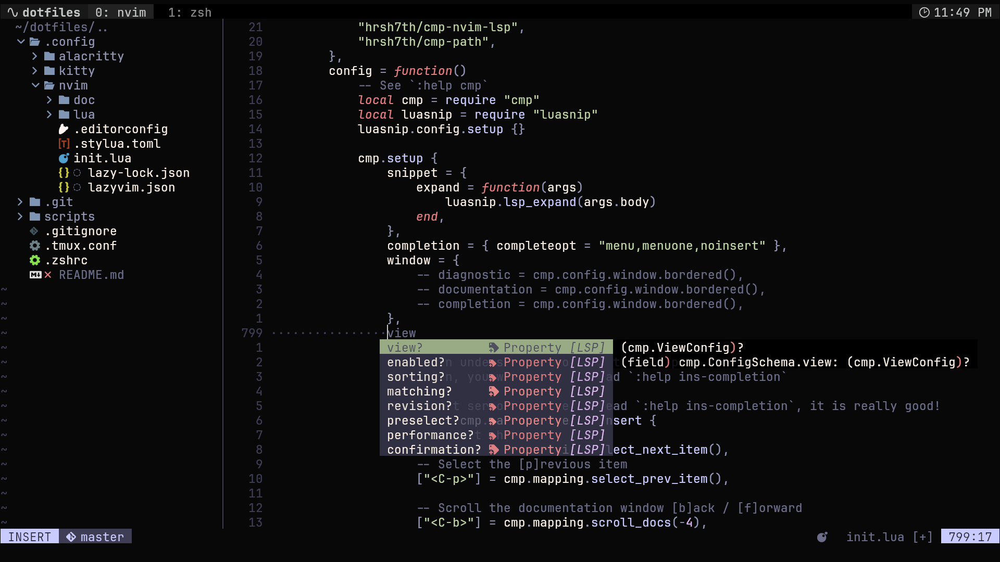
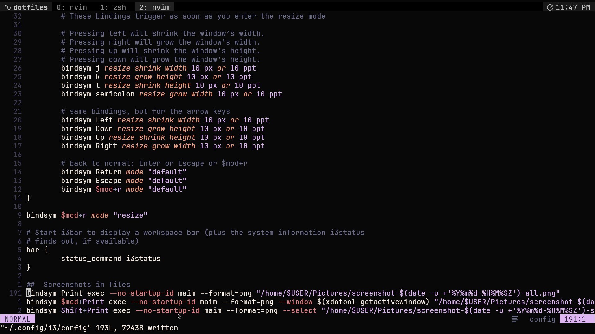
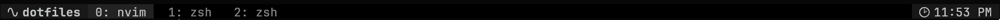

# Dotfiles

CosecSecCot's developement environment, feel free to copy any stuff that you want!

Main stuff that I use:

## Terminal Emulator

### Alacritty (Not using anymore)

There was **no ligature support** so ... HELL NAH, you can still find the config tho

### Kitty

Main Font: **Jetbrains Mono Nerd Font**

You can find kitty config at: `.config/kitty/kitty.conf`

## Neovim

I used [kickstart.nvim](https://github.com/nvim-lua/kickstart.nvim), added some custom pluggins and modified some of the
existing ones

Major Modifications:
- Custom Keymaps for Telescope and LSP
- Transparency in floating menus (pumblend and winblend)
- Telescope Layout

## Tmux

`.tmux.conf` file consists:
- Custom theme (that I tried to make)

- Fix for color distortion issue

## Scripts

Currently the only script that i have is a tmux-sessionizer
